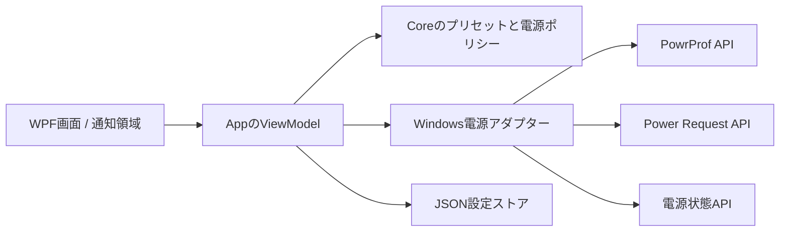

# DisplayLight 設計

## 文書の位置づけ

この文書は、2026年7月15日版の企画仕様書をDisplayLightの実装可能な境界へ整理した設計基準です。
確定していない事項は`docs/OPEN_QUESTIONS.md`へ分離しています。
未決事項が確定した場合は、この文書とArchitecture Decision Record（ADR）を同じ変更で更新します。

## 製品の責務

DisplayLightは、次の二種類の電源操作を一つの通知領域アプリから扱います。

- **ディスプレイ消灯設定**：利用者の明示操作により、現在のWindows電源プランのAC時またはバッテリー時の値を変更します。
- **スリープ防止要求**：利用者が手動で有効にする一時的な要求で、Windows電源プラン自体は変更しません。

この二種類は、変更の持続期間と復旧方法が異なるため、同じ抽象化にまとめません。
ディスプレイを点灯させ続ける機能も、初期範囲には含めません。

## 対象範囲

### MVP

MVPは、企画書のPhase 1からPhase 4までです。
Codexなどの外部エージェントとは連携せず、手動でスリープ防止を開始および解除できる製品として完成させます。

- WPFアプリの起動と終了
- 通知領域からの操作
- AC時とバッテリー時のディスプレイ消灯時間の表示およびスライダーによる変更
- スライダー右端の「無期限」
- 単一インスタンス制御
- 手動のスリープ防止
- AC電源限定
- バージョン付き設定保存
- OS操作を伴わない単体テスト

Codex Hook、複数セッション、自動スリープはAgent Preview以降の独立した実装単位とします。

### 通知領域フライアウト

主画面は、通知アイコンの近くへ表示する幅360から392 DIPの固定幅フライアウトとします。
標準タイトルバー、リサイズ、タスクバー表示を持たせず、通知アイコンの再クリック、外側クリック、Escapeで閉じます。
通知アイコンとフライアウトは、下と上のタスクバーでは水平中心、左右のタスクバーでは垂直中心を原則として揃えます。
中央揃えで画面外へ出る場合は、作業領域から12 DIP相当の余白を残す位置へ補正します。

表示時はフライアウト全体がタスクバー側へ隠れる位置から約250ミリ秒のcubic ease-outで移動し、終了時は約170ミリ秒のcubic ease-inで同じ位置へ戻します。
背景、外周、影、内容を含むウィンドウ全体を一体で移動し、モーション中の不透明度は100%を維持します。
位置更新はWPFの描画フレームへ同期し、最終位置へ到達した後に内容だけを約120ミリ秒でフェードインします。
展開、折りたたみ、状態メッセージによって必要な高さが変わる場合は、通知アイコン側の辺を基準に位置とサイズを約180ミリ秒で同時に補間します。
サイズ変更中は内容をウィンドウ境界でクリップし、完了するまで内部操作を受け付けません。
サイズ変更中の一時的なオーバーフローを含め、フライアウトの縦スクロールバーは常に表示しません。
展開後と折りたたみ後の目標高は外側ウィンドウの現在高ではなく、内容を高さ無制限で再計測した`DesiredSize`と境界線から算出します。
最終サイズのレイアウトとマウス位置を再評価してから操作を再開し、表示位置とボタンの判定領域を一致させます。
伸縮が保留中の再計測や非表示操作で中断された場合も、操作停止状態は必ず解除します。
HWNDの拡張領域へDWM Backdropが先に露出しないよう、サイズ変更中だけHwndSourceのクリア色を外周面と同じ不透明色へ切り替えます。
最終サイズのWPF面が描画された次のフレームでクリア色を透明へ戻し、通常時のDesktop Acrylicを維持します。
参照する時間は録画フレームレートの影響を受けるため目安とし、完全非表示から始まることと速度曲線を優先します。
`SystemParameters.ClientAreaAnimation`が無効な場合は即時に開閉します。
開閉の途中で反対の操作を受けた場合は、進行中のモーションを中断して新しい状態へ移ります。

外観と情報の強弱は[zwnj/BatteryMonitor](https://github.com/zwnj/BatteryMonitor)を参照します。
一枚の半透明サーフェス、小さい製品名、一つの主状態、境界線を抑えた内側カードを採り入れます。
一方、WPF `Popup`、ホバー表示、ピン留め、ドラッグ移動、手動テーマ切替は採用せず、フォーカス可能な小型WPF `Window`を維持します。

スリープ防止を最初の主要操作として表示し、AC電源限定を従属設定として配置します。
AC時とバッテリー時の消灯時間は一つのセクションへまとめ、現在の電源側だけを初期展開します。
AC時とバッテリー時の見出しはそれぞれ独立して展開と折りたたみができ、両方を閉じた状態も許可します。

消灯時間のプリセットは、見た目を離散スライダーとして保ちながら、Automationでは名前付きの選択肢として公開します。
利用者が選択した値は選択中にWindowsへ書き込まず、現在値と異なる場合だけ「適用」を表示します。
「適用」の表示切替では操作領域をあらかじめ確保し、フライアウトの高さを変えません。
未適用の変更がある場合は、現在値を輪郭リング、変更後の選択をアクセント色のつまみで示し、色だけに頼らず両者を区別します。
六つのプリセットは等間隔に置き、時間へ比例する連続値とは扱いません。

色は意味別の動的リソースへ集約し、Windowsのライトテーマ、ダークテーマ、高コントラストへ追従します。
Windows 11の背景効果を外観候補として検証し、利用できない場合と高コントラストでは単色サーフェスとDWM角丸で操作性を維持します。
最外周はDWMとWPFの前景サーフェスをWindows 11のフライアウト標準である8 DIPへ揃えます。

### 対象外

- エージェント自体の起動、停止、権限承認
- ユーザーが電源ボタン、蓋、スタートメニューから行う明示的なスリープの阻止
- モニター単位の制御
- クラウド同期、アカウント、テレメトリー
- プロンプト、回答、ソースコード、ファイル内容の収集
- Windows以外への移植

## 安全性の不変条件

次の条件は、UIや連携方式を変更しても維持します。

1. 既定状態では自動スリープを実行しません。
2. システムスリープを防止している間も、ディスプレイ消灯は許可します。
3. 電源要求の所有者はアプリプロセスとし、プロセス終了後に要求が残らない方式を選びます。
4. エラー、利用者の解除、アプリ終了では、スリープ防止要求を解放してWindowsの通常管理へ戻します。
5. 自動スリープは、明示的な有効化、カウントダウン、利用者が到達可能なキャンセル手段の三条件が揃う場合だけ実行します。
6. 自動テストは、実際の電源設定変更、スリープ、休止、シャットダウンを呼び出しません。
7. 外部イベント一件だけを根拠に、複数セッション全体の完了を確定しません。
8. 外部入力が不正または古い場合は、スリープ防止を無期限に保持しません。

独自の低バッテリー下限は設けません。
バッテリー消費を抑えたい利用者は、AC電源限定を選択できます。

## システム構成



Coreは判断を行い、AppはWindowsとの入出力を行います。
Win32 APIから受け取った値をCoreへ直接流さず、App側のアダプターでエラーを検証してからViewModelへ返します。
Agent Previewで連携を追加する場合は、外部入力を検証するアダプターを同じ境界へ追加します。

## ソリューション境界

### DisplayLight.Core

`DisplayLight.Core`は`net10.0`を対象とし、Windows固有APIへ依存しません。
次の責務を持たせます。

- ディスプレイ消灯時間のプリセットと秒数の対応
- 手動スリープ防止を要求または解放するポリシー
- AC限定の判定
- 設定値と入力値の検証
- OS操作を表すポート（インターフェース）

セッション状態、複数セッションの集約、完了後アクション、カウントダウンはAgent Previewで追加します。

フォルダーは機能が生まれた時点で`Agents`、`Power`、`Settings`などの機能単位に分けます。
空のレイヤーフォルダーを先に作りません。

### DisplayLight.App

`DisplayLight.App`は`net10.0-windows`と`win-x64`を対象とします。
次の責務を持たせます。

- WPFのViewとViewModel
- 通知領域アイコン、メニュー、通知
- アプリケーションのライフサイクルと依存関係の組み立て
- 単一インスタンス制御
- PowrProf API、Power Request API、電源状態、ファイル保存の各アダプター

Windows固有コードが増えて独立したテスト境界が必要になった場合だけ、`DisplayLight.Infrastructure.Windows`への分離を検討します。
初期段階でプロジェクトを増やすと、依存関係の管理量だけが先に増えるためです。

### DisplayLight.Core.Tests

`DisplayLight.Core.Tests`は、実機を変更せずにプリセット、設定値、電源ポリシーを検証します。
`DisplayLight.App.Tests`は、ネイティブAPIのテストダブルと一時ディレクトリを使い、WindowsアダプターとViewModelを検証します。

## 状態モデル

### MVPの手動スリープ防止

MVPでは、利用者の要求、AC限定設定、現在の電源状態を分けて保持します。
利用者の要求は、バッテリーへ切り替わって物理的な要求を解放した後も保持します。
ACへ戻った場合は、利用者が解除していなければ物理的な要求を再取得します。

| 利用者の要求 | AC限定 | 電源状態 | 物理的な要求 | 表示 |
|---|---|---|---|---|
| 無効 | 任意 | 任意 | 解放 | 無効 |
| 有効 | 無効 | 任意 | 保持 | 有効 |
| 有効 | 有効 | AC | 保持 | 有効 |
| 有効 | 有効 | バッテリー | 解放 | AC電源接続待ち |
| 有効 | 有効 | 不明 | 解放 | 電源状態不明のため解除 |

手動スリープ防止の要求状態とネイティブハンドルは永続化しません。
アプリを再起動した場合は、通常のWindows電源管理から始めます。

### Agent Previewの状態モデル

Agent Previewでは、個別セッションの`Working`、`WaitingForInput`、`Completed`、`Failed`、`Unknown`と、全体の集約状態を別に設計します。
`Stop`など一件の外部イベントだけで全セッションの完了を確定しません。
手動要求とエージェント要求は所有者を分け、片方を解除しても別の所有者が有効なら物理的な要求を保持します。
詳細な完了規則とカウントダウンは、実機で連携イベントを観測した後に確定します。

## 電源操作

### ディスプレイ消灯時間

現在の電源プランは`PowerGetActiveScheme`で取得します。
AC値とDC値は`PowerReadACValueIndex`および`PowerReadDCValueIndex`で読み取ります。
変更は`PowerWriteACValueIndex`または`PowerWriteDCValueIndex`で行い、`PowerSetActiveScheme`で反映します。
対象はディスプレイ設定サブグループの`VIDEOIDLE`で、値は秒単位、`0`は無期限です。
変更後はAC値とDC値を再取得し、対象値が要求どおりの場合だけ成功と表示します。

消灯時間は、`1分`、`5分`、`10分`、`30分`、`60分`、`無期限`を離散的に選ぶスライダーで操作します。
スライダーの一番右を`無期限`とし、MVPでは任意の数値を入力するカスタム欄を設けません。
AC時とバッテリー時は対象を切り替えて、それぞれのスライダー値を設定します。

`powercfg`の出力は利用せず、表示言語に依存する文字列を解析しません。
Windows側にプリセット外の値がある場合は、その実値を表示し、スライダーを近い値へ黙って移動しません。
保存されているスライダーの選択は「前回選択」として示し、利用者が選択を動かすまでは未適用変更として扱いません。

利用者が明示的に変更した消灯時間は、現在の電源プランに対する通常の設定変更です。
アプリ終了時に自動復元する一時変更とは扱いません。
変更前の値へ戻す専用操作も設けず、利用者はスライダーから別の値へ切り替えます。

### スリープ防止要求

スリープ防止には`PowerCreateRequest`、`PowerSetRequest`、`PowerClearRequest`を使用します。
理由文字列を持つプロセス所有の要求を作成し、利用者が必要とする期間だけ保持します。

要求種別は`SystemRequired`だけとし、`DisplayRequired`、`AwayModeRequired`、`ExecutionRequired`は使用しません。
これによりアイドルによるシステムスリープを抑止しながら、設定時間後のディスプレイ消灯を許可します。

利用者が明示したスリープ、システムポリシー、Modern StandbyのDC時制約はOS側が優先されます。
Modern Standbyのバッテリー動作では、システムスリープタイムアウト後に要求の効力が制限されるため、常時維持を保証しません。
復帰通知を受けた場合は、要求が有効だったときだけハンドルを作り直します。

### 自動スリープ

自動スリープは後続機能です。
`SetSuspendState(false, false, false)`相当の呼び出しは、Coreがカウントダウン完了を確定した後、Appの専用アダプターから一度だけ行います。

実行直前に新しい`Working`セッション、電源条件、キャンセル状態を再評価します。
API失敗時は再試行ループに入らず、失敗を通知して通常の電源管理へ戻します。

## エージェント連携

この章はAgent Previewの検討事項であり、MVPにはIPC、Hook、セッション集約を実装しません。

### イベント境界

連携コマンドは、標準入力で受け取ったHookイベントを、バージョン付きの内部イベントへ変換します。
最低限の内部フィールドは次のとおりです。

```text
schemaVersion
source
sessionId
eventType
occurredAtUtc
workspaceId（任意、既定では非永続）
```

IPC受信側は、スキーマ版、文字数、時刻のずれ、イベント種別を検証します。
セッション識別子は連携元の値をそのままログへ出さず、必要な場合はプロセス内で短縮またはハッシュ化します。

### Codex Hookの意味

Codexの`UserPromptSubmit`と`Stop`はターン単位のイベントです。
`Stop`は製品上の全作業完了を保証しないため、それだけで`Completed`へ遷移させたり、自動スリープを開始したりしません。

Codex連携アダプターは「ターン開始」「ターン停止」「権限待ち」など、観測できた事実を内部イベントへ変換します。
製品上の`Completed`を何から確定するかは、実機でHook payloadとCodex AppおよびCLIのライフサイクルを記録した後に決めます。

### IPC

WPFアプリは、現在のWindowsユーザーだけが接続できる名前付きパイプを待ち受けます。
メッセージは長さ上限を持つ一件一JSON形式とし、プロトコル版が一致しない入力を拒否します。

アプリが起動していない場合の扱いは未決です。
連携コマンドがアプリを起動する方式と、イベントを破棄して終了する方式のどちらにするかをQ8で決定します。

### 欠落イベント

Hookプロセスの異常終了やアプリ再起動では、終了イベントが欠落します。
そのため、セッションには最終観測時刻と有効期限を持たせ、永続化したセッション状態を無条件に復元しません。

有効期限の長さと、heartbeatを導入するかは連携元ごとに決めます。
単なるプロセス存在確認は`Working`の確証にせず、補助情報として扱います。

## アプリのライフサイクル

1. 単一インスタンス用の所有権を取得します。
2. OSアダプター、設定ストア、ViewModelを生成します。
3. 非表示のWPFフライアウトからウィンドウハンドルを作成します。
4. 通知領域アイコンを追加します。
5. 通知アイコンの近くへフライアウトを表示し、設定と現在のWindows電源状態を読み込みます。
6. 終了要求では電源要求を解放し、通知領域アイコンを削除します。
7. 終了処理の一部が失敗しても、残りの解放処理を継続します。

二重起動したプロセスは、既存プロセスへ表示要求を送り、自身は電源状態を変更せず終了します。
フライアウトを閉じる操作は表示だけを終了し、補助メニューまたは通知領域の「終了」だけがプロセスを終了します。

## 設定保存

設定は`%LOCALAPPDATA%\DisplayLight\settings.json`へ保存します。
ローミング同期を意図しない端末固有の電源設定であるため、`ApplicationData`のRoaming配下は使用しません。

設定には`schemaVersion`を含めます。
保存時は同じディレクトリへ一時ファイルを書き、フラッシュ後に置き換えて、途中終了による破損を抑えます。

永続化するのは利用者設定だけです。
MVPでは、選択したACとDCのプリセット、およびAC限定設定を保存します。
手動スリープ防止の要求状態と電源要求ハンドルはプロセス内状態とし、再起動後に復元しません。

## エラーと通知

Windowsアダプターは失敗コードを例外へ変換し、ViewModelが利用者向けの状態表示へ反映します。
UIは成功を推測せず、変更後の読戻しが完了した場合だけ成功を表示します。

- OS操作失敗：実行しようとした操作の近くへWindowsエラーコードを表示します。
- 操作成功：Politeライブリージョンへ短時間表示し、自動的に消去します。
- 電源状態取得失敗：AC限定時は要求を解放し、通常のWindows電源管理へ戻します。
- 電源要求失敗：利用者の要求状態を解除し、ネイティブハンドルを閉じます。
- 設定破損：元ファイルを`settings.corrupt.<UTC時刻>.json`として残し、安全な既定値で起動します。

## プライバシーとセキュリティ

ネットワーク通信は製品機能に含めません。
更新確認を将来追加する場合も、明示した別機能として設計します。

Agent Previewで名前付きパイプを採用する場合は現在ユーザーへ限定し、受信サイズ、JSONの深さ、文字列長を制限します。
作業ディレクトリを扱う場合はUI表示に必要な間だけプロセス内で保持し、設定と通常ログへ保存しません。

ログの既定レベル、保存期間、利用者による消去方法はQ10で決定します。

## 検証戦略

検証は、純粋ロジック、Windowsアダプター、実機挙動の三段階に分けます。

- Core単体テスト：プリセット変換、設定の正規化、手動要求とAC限定の優先順位。
- アダプターテスト：PowrProf APIの呼び出し順序、読戻し、エラー変換、設定の原子的保存。
- 実機テスト：通知領域、ACとバッテリー、ディスプレイ消灯、Modern Standby、スリープと復帰。

実機テストの手順と記録項目は`docs/TESTING.md`に定義します。
CIはWindows上でformat、Release build、unit testを実行し、実電源操作は行いません。

## 配布

初期ターゲットはx64のWindows 11です。
開発中はframework-dependentで実行し、配布候補ではself-containedの単一RID発行を検証します。

MSIX、署名、自動更新、自動起動方式は配布設計としてまとめて決定します。
インストーラーを選ぶ前に、通知領域アプリの自動起動、更新時の実行中プロセス、アンインストール時の設定保持を確認します。

## 変更の記録

次の変更はADRを追加します。

- 電源要求APIの選択
- ディスプレイ設定の読み書き方式
- 通知領域ライブラリまたは直接Win32実装の選択
- IPC方式と起動方式
- 設定形式または保存場所の変更
- 配布形式と自動更新方式

小さく戻せる実装詳細はADRにせず、コードとテストで説明します。
